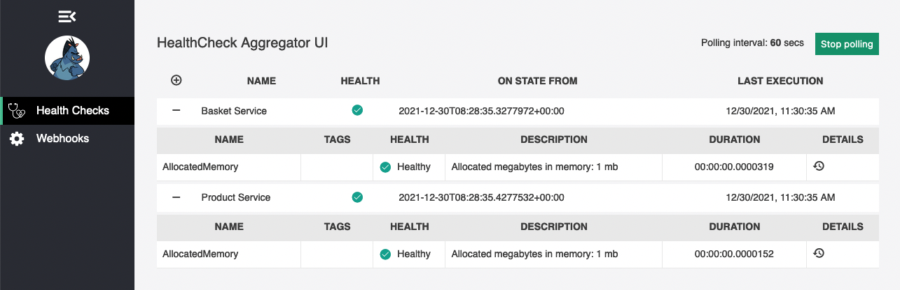

# Healthcheck Aggregator UI

Two simple microservices and one health check UI service have been developed to explain the approach.
## Downstream Microservices
Basket and Product services represent microservices.


A simple health check service has been added to both services for proof of concept. ProcessAllocatedMemoryHealthCheck checks the process memory exceeds the threshold or not using AspNetCore.HealthChecks.System library. In this example, 100 MB has been set as a limit. If this limit is exceeded, the service will respond as unhealthy.

```cs
public void ConfigureServices(IServiceCollection services)
{
    services.AddHealthChecks()
            .AddProcessAllocatedMemoryHealthCheck(100, "Memory");
}
```

Let's configure the `/health` endpoint to return health check results as JSON.

```cs
public void Configure(IApplicationBuilder app)
{
    app.UseEndpoints(endpoints =>
    {
        endpoints.MapHealthChecks("/health", new HealthCheckOptions()
        {
            ResponseWriter = UIResponseWriter.WriteHealthCheckUIResponse
        });
    });
}
```

## Aggregator UI

All possible parameters in the aggregator UI application are placed in the appsettings.json file. Two sections are written for configuration parameters: HealthCheck and Services. In the HealthCheck section, there are parameters for the UI.

```cs
"HealthCheck": {
    "HeaderText": "HealthCheck Aggregator UI",
    "PollingInterval": 60,
    "UIPath": "/health-ui",
    "ApiPath": "/health-api"
}
```

- Header Text: header in the page
- PollingInterval: polling interval in seconds
- UIPath: relative path for UI
- ApiPath: relative path for JSON response

The second section is Services that contains the information of the services to be aggregated.

```
"Services": [
  {
    "Name": "Basket Service",
    "Url": "http://basketservice/health"
  },
  {
    "Name": "Product Service",
    "Url": "http://productservice/health"
  }
]
```

### How to run

A docker-compose file can be used to run demo with `docker-compose up` command.

The health check UI will be accessible at [http://localhost:5001/health-ui]([http://localhost:5001/health-ui])


